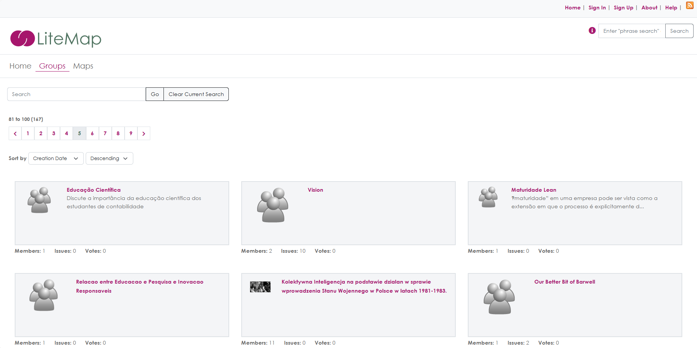
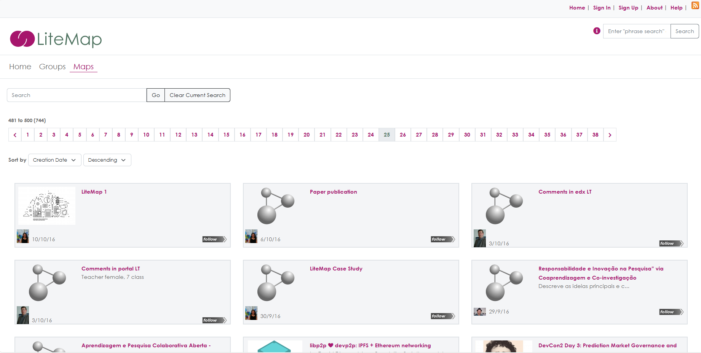

> [!IMPORTANT]
> This code base was developed as part of research conducted at the Knowledge Media Institute at The Open University. This code base is no longer in active development. The majority of the code was originally developed between 2012 and 2015 with various updates and tweaks over the following years, so a lot of the code is old in style and development practices.

> [!WARNING]  
> Some of the documentation in the `docs` folder may be out of date.

## License
CIDashboard is Copyright (c) 2015-2025 The Open University.

This software is freely distributed in accordance with                      
the GNU Lesser General Public (LGPL) license, version 3 or later           
as published by the Free Software Foundation.                            
For details see LGPL: <http://www.fsf.org/licensing/licenses/lgpl.html>
and GPL: http://www.fsf.org/licensing/licenses/gpl-3.0.html

CIDashboard is Copyright (c) 2015-2025 The Open University.

## Installation

The ***docs*** folder has the LiteMap Documentation which includes instructions for setting up a LiteMap instance (index.html). 
The ***src/install*** folder has the sql for adding the required tables for the database (utf8 Database please) and the 
script for adding the default data to those tables.

Start by going to ***docs/index.html*** and read the notes.

## Description

Developed by the Open University’s Knowledge Media Institute, LiteMap is a Web tool for mapping out visually the content of online debates across different forums and Websites. With LiteMap users can harvest issues, ideas, pros and cons of public debates and connect them in meaningful network graphs. LiteMap supports web annotation and visual summarisation to trigger reflection, promote deeper understanding and improve engagement with online debates.
Features
 - A ***bookmarklet*** to harvest and annotate content while browsing the Web
 - 2-D ***mapping canvases*** to connect ideas and build argument maps.
 - A ***Community Website*** to collaboratively create and share maps.
 - A ***Visualisation Dashboard*** to support sensemaking and reflection.

Online discussions on issues of public concern are often dispersed across different Websites and Social Media environments. This makes it difficult for stakeholders to make sense of the state and progress of a public debate.

LiteMap is a tool to support sensemaking and summarization of public debates across Web forums and discussion media. By allowing easy markup and annotation through any Web browser, LiteMap enables users to grasp clips of text from an online conversation and make them objects of further reflection and discussion. Within LiteMap content from previously disconnected online conversations and debates can be connected in new meaningful ways. Visual maps can be built by single users or groups to make a point or better communicate ideas and results to others. LiteMap is designed to help both community managers.

Community managers can use LiteMap to organise contributions to the debate, reduce idea duplication, and support content analysis and summarisation.

Community members can use LiteMap for sensemaking and self-reflection: to build a visual representation of their own view of a topic or debate; to communicate personal ideas to others; and to point the community’s attention to important issues.

LiteMap is one of the Catalyst’s ecosystem of Collective Intelligence Tools to improve community deliberation of complex societal challenges.

## Screenshots

### Example LiteMap homepage

### Example LiteMap groups page

### Example LiteMap maps page

### Example LiteMap map page

## Acknowledgments
LiteMap’s design, development and testing was undertaken as part of the FP7 Project Catalyst on *Collective Applied Intelligence and Analytics for Social Innovation*  - by the  team (Anna De Liddo, and Michelle Bachler) at the Open University. We are indebted to Harriett Cornish for graphic design.

## Repository

[Open Source code]( https://github.com/idea-kmi/LiteMap)

## Status
Archived - no active development.
